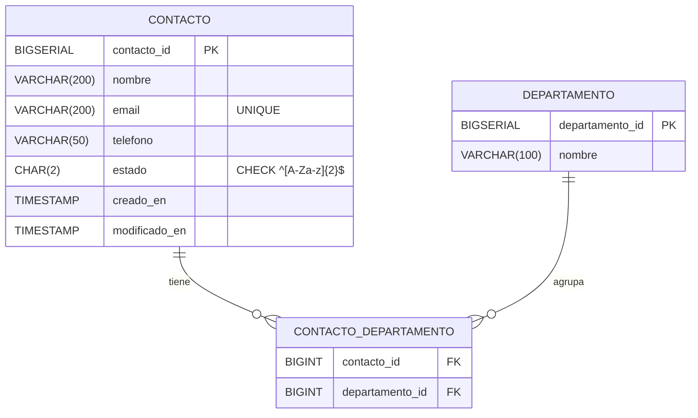
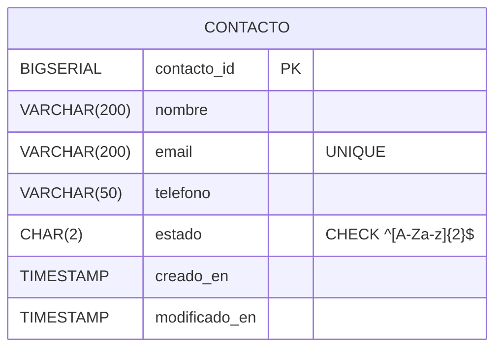

# Diagrama Entidad–Relación (ER) — Proyecto Contactos
**Fecha:** 2025-08-19

Este archivo describe el **ER completo** del proyecto en dos partes:
1. **Modelo final (recomendado)**: contactos con vinculación a departamentos (normalizado).
2. **Modelo mínimo (solo contactos)**: útil si solo se necesita el CSV base `nombre,email,telefono,estado`.

> El diagrama está en **Mermaid**. GitHub y varios editores lo renderizan automáticamente.

---

## 1) Modelo final (recomendado)



**Notas:**
- `email` es **único** (se usa como clave natural para *upsert*).
- `estado` debe tener exactamente **2 letras** (`CHECK` y validación en API).
- `CONTACTO_DEPARTAMENTO` permite **N:M** (un contacto puede pertenecer a varios departamentos).

---

## 2) Modelo mínimo (solo contactos)



---

## SQL de referencia (Postgres)

```sql
CREATE TABLE IF NOT EXISTS public.contacto (
  contacto_id    BIGSERIAL PRIMARY KEY,
  nombre         VARCHAR(200) NOT NULL,
  email          VARCHAR(200) NOT NULL UNIQUE,
  telefono       VARCHAR(50),
  estado         CHAR(2) NOT NULL,
  creado_en      TIMESTAMP NOT NULL DEFAULT now(),
  modificado_en  TIMESTAMP NULL,
  CONSTRAINT chk_contacto_estado_2letters CHECK (estado ~ '^[A-Za-z]{2}$')
);

-- Extensión opcional para departamentos (N:M)
CREATE TABLE IF NOT EXISTS public.departamento (
  departamento_id BIGSERIAL PRIMARY KEY,
  nombre          VARCHAR(100) NOT NULL
);

CREATE TABLE IF NOT EXISTS public.contacto_departamento (
  contacto_id     BIGINT NOT NULL REFERENCES public.contacto(contacto_id) ON DELETE CASCADE,
  departamento_id BIGINT NOT NULL REFERENCES public.departamento(departamento_id) ON DELETE CASCADE,
  PRIMARY KEY (contacto_id, departamento_id)
);
```

---

## Consideraciones
- En **API** y en **BD** se valida que `estado` tenga longitud **2** y contenga solo letras (`^[A-Za-z]{2}$`).
- Para *upsert* por `email`: define `email` como **UNIQUE** y maneja colisiones en la capa de aplicación.
- `modificado_en` se actualiza en operaciones **UPDATE**.
