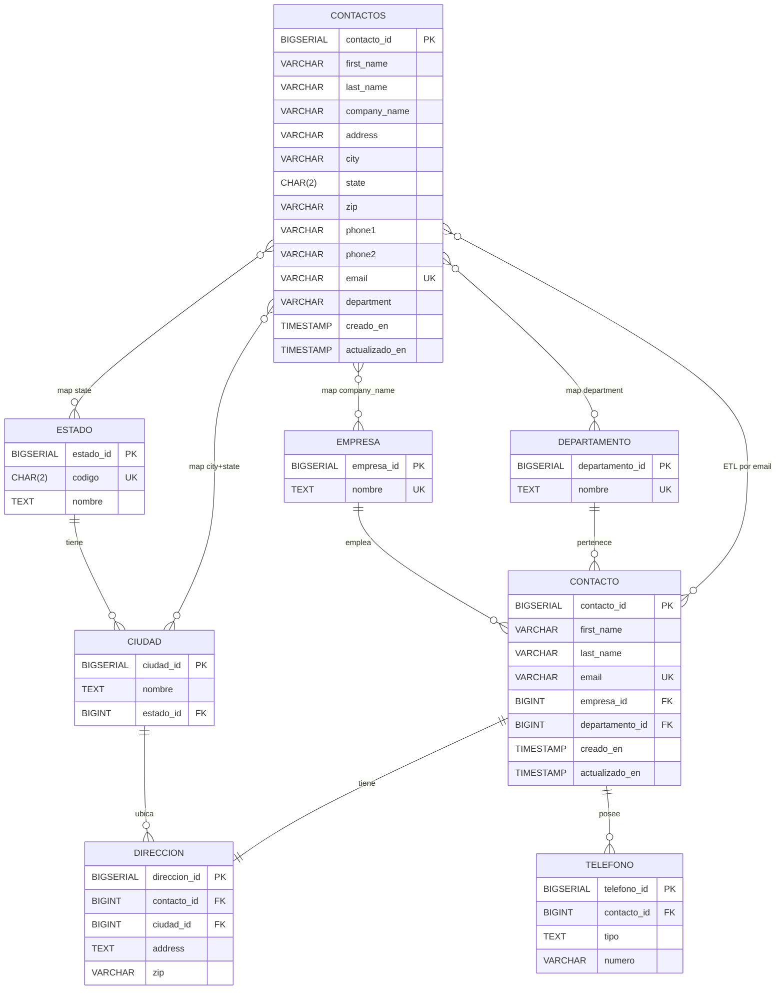

# Diagrama E‑R (Mermaid)

> Pega este bloque en https://mermaid.live para visualizarlo.

```mermaid
erDiagram
    ESTADO ||--o{ CIUDAD : "tiene"
    CIUDAD ||--o{ DIRECCION : "ubica"
    EMPRESA ||--o{ CONTACTO : "emplea"
    DEPARTAMENTO ||--o{ CONTACTO : "pertenece"
    CONTACTO ||--|| DIRECCION : "tiene"
    CONTACTO ||--o{ TELEFONO : "posee"

    ESTADO {
      BIGSERIAL estado_id PK
      CHAR(2)   codigo UK
      TEXT      nombre
    }

    CIUDAD {
      BIGSERIAL ciudad_id PK
      TEXT      nombre
      BIGINT    estado_id FK
    }

    EMPRESA {
      BIGSERIAL empresa_id PK
      TEXT      nombre UK
    }

    DEPARTAMENTO {
      BIGSERIAL departamento_id PK
      TEXT      nombre UK
    }

    CONTACTO {
      BIGSERIAL contacto_id PK
      VARCHAR   first_name
      VARCHAR   last_name
      VARCHAR   email UK
      BIGINT    empresa_id FK
      BIGINT    departamento_id FK
      TIMESTAMP creado_en
      TIMESTAMP actualizado_en
    }

    DIRECCION {
      BIGSERIAL direccion_id PK
      BIGINT    contacto_id FK
      BIGINT    ciudad_id FK
      TEXT      address
      VARCHAR   zip
    }

    TELEFONO {
      BIGSERIAL telefono_id PK
      BIGINT    contacto_id FK
      TEXT      tipo
      VARCHAR   numero
    }

    CONTACTOS {
      BIGSERIAL contacto_id PK
      VARCHAR   first_name
      VARCHAR   last_name
      VARCHAR   company_name
      VARCHAR   address
      VARCHAR   city
      CHAR(2)   state
      VARCHAR   zip
      VARCHAR   phone1
      VARCHAR   phone2
      VARCHAR   email UK
      VARCHAR   department
      TIMESTAMP creado_en
      TIMESTAMP actualizado_en
    }

    CONTACTOS }o--o{ CONTACTO : "ETL por email"
    CONTACTOS }o--o{ EMPRESA : "map company_name"
    CONTACTOS }o--o{ DEPARTAMENTO : "map department"
    CONTACTOS }o--o{ CIUDAD : "map city+state"
    CONTACTOS }o--o{ ESTADO : "map state"
```
